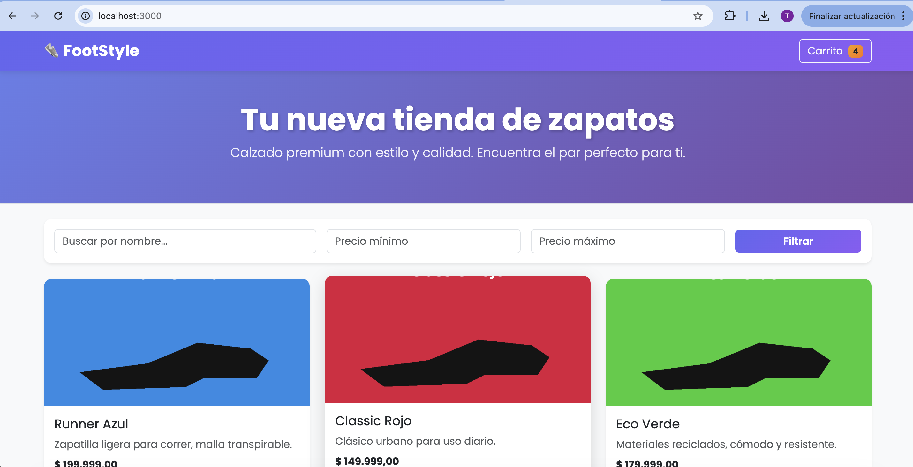
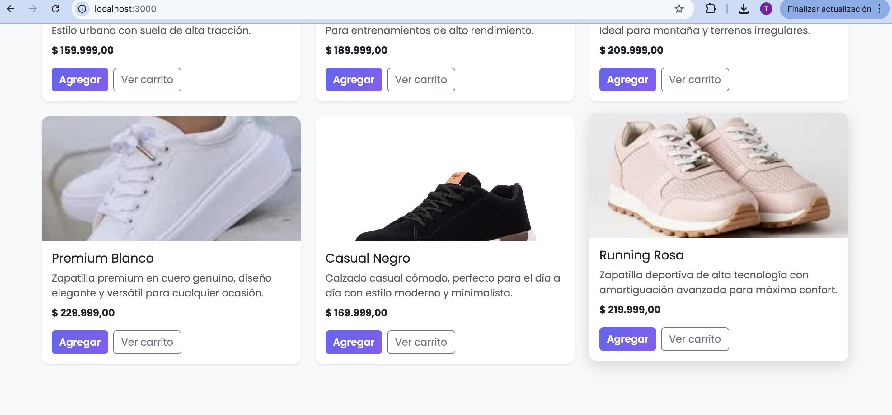
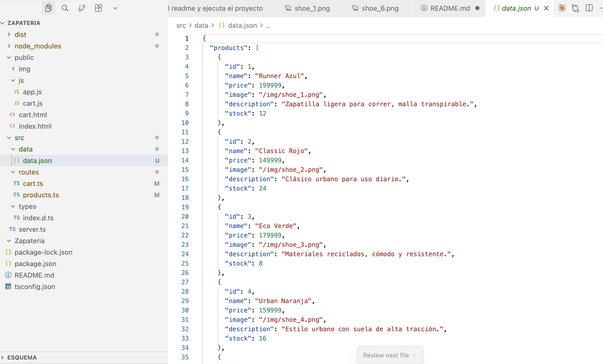
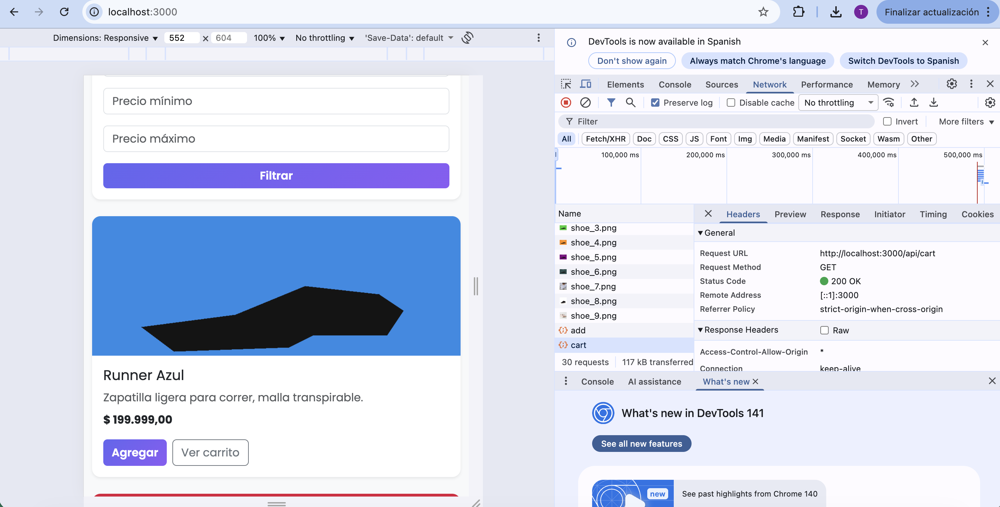

# Proyecto de zapateria App

Integrantes Brandon Bernal, Andres Barrera, Tatiana Montenegro, Yuliana Paez
--
# 🧩 Instrucciones de instalación, configuración y ejecución del proyecto

Este documento describe paso a paso el proceso de instalación, configuración y ejecución del proyecto **Zapatería App**, con capturas de pantalla del procedimiento completo.

## 🧱 1️⃣ Inicialización del repositorio local

1. Abre una terminal en la carpeta del proyecto.
2. Ejecuta el comando para inicializar un nuevo repositorio Git:

git init

## ☁️ 2️⃣ Creación del repositorio remoto en GitHub
Ingresa a GitHub y crea un nuevo repositorio con el nombre zapateria-app.

Copia la URL del repositorio remoto.

## 🔗 3️⃣ Vinculación del repositorio local con el remoto
Conecta el repositorio local al remoto usando:

Usando 
git add .
git commit -m "Iniciando"
git remote add origin 
git push origin main

([https://github.com/BrandonB30/MacaBlue/blob/main/assets/images/Panel%20Admin.jpg](https://github.com/BrandonB30/Zapateria/blob/main/public/img/Git_Push.png))

## ⚙️ 5️⃣ Instalación de dependencias del proyecto
Una vez clonado o descargado el proyecto, abre una terminal en la raíz del proyecto.

Ejecuta:

bash
Copy code
npm install
Esto instalará todas las dependencias necesarias definidas en el archivo package.json.

🚀 6️⃣ Ejecución del servidor
Para correr el servidor en modo desarrollo:

bash
Copy code
npm run dev
El servidor se ejecutará en el puerto 3000.
Abre tu navegador y entra en:

arduino
Copy code
http://localhost:3000

Y con esto finalizamos y comprobamos el funcionamiento de la pagina.

2) **Personalización del frontend:**

Se realizó una renovación completa del diseño visual de la aplicación, cambiando el nombre de la tienda de "Zapatería Aether" a "FootStyle" con un nuevo logo. Se implementó un esquema de colores moderno con gradientes en índigo y púrpura (#6366f1 → #8b5cf6) para el navbar, header y botones principales. Se cambió la tipografía a "Poppins" de Google Fonts para mejorar la legibilidad y estética. Se agregaron efectos de hover, sombras y transiciones suaves en las tarjetas de productos. El diseño mantiene completamente el formato responsive de Bootstrap, asegurando una experiencia óptima en todos los dispositivos. Los cambios se aplicaron tanto en `index.html` como en `cart.html` para mantener consistencia visual en toda la aplicación.

3) **Ampliación del catálogo de productos**:

Se agregaron tres nuevos productos al catálogo en el archivo `src/routes/products.ts`:
- **Premium Blanco** : Zapatilla premium en cuero genuino, precio $229,999 COP, stock de 15 unidades, imagen `/img/shoe_7.png`
- **Casual Negro**: Calzado casual cómodo con estilo moderno, precio $169,999 COP, stock de 20 unidades, imagen `/img/shoe_8.png`
- **Running Rosa** : Zapatilla deportiva de alta tecnología con amortiguación avanzada, precio $219,999 COP, stock de 11 unidades, imagen `/img/shoe_9.png`

Cada producto incluye nombre, precio, descripción detallada y cantidad en stock. Las imágenes correspondientes fueron guardadas en la carpeta `/public/img/` con los nombres `shoe_7.png`, `shoe_8.png` y `shoe_9.png` respectivamente. 

4) **Implementación de un filtro de búsqueda :**

Se implementa un container, el botón de filtrar que realizará la acción y los espacios para los diferentes inputs.
Mediante la funcion function setupFilters() se establece como se aplicarán los filtros acompañado con un event listener "filterBtn.addEventListener" se declara que la accion se realiza cuando se da click al botón.

5) **Ruta adicional en el backend que calcula la cantidad y precio total de los productos.**

Se usa una nueva ruta que toma los elementos existentes del carrito, mediante el uso de objetos JSON y el .map que recorre los objetos agregados para calcular el total en unidades agregadas y el precio final.
Se realizan pruebas usando Postman para testear el GET y POST.

Se agregan 3 unidades del producto con Id 2  http://localhost:3000/api/cart/add

Se agregan 4 unidades del producto con Id 1  http://localhost:3000/api/cart/add

Se obtiene el total agregado. http://localhost:3000/api/cart/total

6) **Persistencia simple de datos:**

Se implementó un sistema de persistencia de datos utilizando el módulo `fs.promises` de Node.js para leer y escribir datos en un archivo JSON. Se creó la carpeta `/src/data/` y el archivo `data.json` que almacena tanto la lista de productos como los carritos de compra de cada sesión.

**Estructura del archivo `data.json`:**
- `products`: Array con todos los productos del catálogo (9 productos iniciales)
- `carts`: Objeto que almacena los carritos por sesión, donde cada clave es un `sessionID` y el valor es un array de items del carrito

**Modificaciones realizadas:**

1. **`src/routes/products.ts`**: Se actualizaron las rutas para leer los productos desde `data.json` en lugar de un array en memoria. Se implementaron las funciones `readData()` y `writeData()` para manejar las operaciones de lectura y escritura del archivo JSON.

2. **`src/routes/cart.ts`**: Se modificaron todas las rutas del carrito (`GET /api/cart`, `POST /api/cart/add`, `POST /api/cart/remove`, `POST /api/cart/clear`, `GET /api/cart/total`) para que lean y escriban los carritos en `data.json`. Cada sesión tiene su propio carrito identificado por `sessionID`, permitiendo que múltiples usuarios tengan carritos independientes.

**Beneficios de la implementación:**
- Los datos persisten entre reinicios del servidor
- Los productos y carritos se mantienen aunque el servidor se detenga
- Cada usuario tiene su propio carrito independiente
- Fácil de modificar y mantener los datos directamente en el archivo JSON
- Sistema simple y eficiente para proyectos pequeños y medianos

7.	**Validación de datos en el servidor:**

Se implementó validación de datos en todas las rutas del servidor para asegurar la integridad de la información. Las validaciones incluyen:
- Verificación de que los parámetros requeridos estén presentes (productId, qty)
- Validación de tipos de datos (números, strings)
- Validación de rangos (cantidades mayores a 0)
- Manejo de errores con respuestas HTTP apropiadas (400 para errores de validación, 404 para recursos no encontrados, 500 para errores del servidor)
- Try-catch en todas las operaciones asíncronas para capturar y manejar errores de manera adecuada

8.	**Mejora visual del carrito:**

El carrito de compras fue mejorado visualmente para proporcionar una mejor experiencia de usuario. Se implementaron mejoras en la interfaz con Bootstrap, incluyendo:
- Diseño responsive que se adapta a diferentes tamaños de pantalla
- Tabla organizada con información clara de productos, cantidades y subtotales
- Botones de acción claramente visibles (Vaciar carrito, Seguir comprando)
- Integración con el diseño general de FootStyle manteniendo la consistencia visual
- Actualización dinámica del contador de items en el navbar

9.	**Documentación del proyecto:**

•	**Nombres y roles de los integrantes:**

- **Tatiana Montenegro** - Desarrollo y diseño frontend
- **Brandon Bernal** - Desarrollo backend y configuración del servidor
- **Yuliana Paez** - Funcionalidades del carrito y persistencia de datos
- **Andres Barrera** - Integración frontend-backend y testing

•	**Dependencias utilizadas:**

**Dependencias de producción:**
- `express` (^4.19.2): Framework web para Node.js, maneja las rutas y el servidor HTTP
- `cors` (^2.8.5): Middleware para habilitar Cross-Origin Resource Sharing
- `cookie-session` (^2.0.0): Middleware para manejo de sesiones basadas en cookies

**Dependencias de desarrollo:**
- `typescript` (^5.6.3): Lenguaje de programación tipado
- `tsx` (^4.20.6): Ejecutor de TypeScript para desarrollo
- `ts-node` (^10.9.2): Ejecuta TypeScript directamente en Node.js
- `@types/express`, `@types/cors`, `@types/cookie-session`: Tipos TypeScript para las dependencias

•	**Descripción general de las rutas del backend:**

**Rutas de Productos (`/api/products`):**
- `GET /api/products`: Obtiene todos los productos del catálogo desde `data.json`
- `GET /api/products/:id`: Obtiene un producto específico por su ID

**Rutas del Carrito (`/api/cart`):**
- `GET /api/cart`: Obtiene el carrito de la sesión actual desde `data.json`
- `POST /api/cart/add`: Agrega un producto al carrito (requiere `productId` y `qty` en el body)
- `POST /api/cart/remove`: Remueve un producto del carrito (requiere `productId` en el body)
- `POST /api/cart/clear`: Vacía completamente el carrito de la sesión actual
- `GET /api/cart/total`: Calcula y retorna el total del carrito con detalles de cada item (cantidad, subtotal, precio unitario)

Todas las rutas utilizan persistencia en `data.json` mediante `fs.promises` y manejan sesiones individuales mediante `cookie-session`.

•	**Explicación breve del funcionamiento del carrito y de la integración front-back:**

**Funcionamiento del Carrito:**

El carrito funciona mediante sesiones individuales. Cada usuario tiene un `sessionID` único que se genera automáticamente mediante `cookie-session`. Los carritos se almacenan en `data.json` bajo la clave del `sessionID`, permitiendo que múltiples usuarios tengan carritos independientes.

**Flujo de operaciones:**
1. Cuando un usuario agrega un producto, el frontend envía una petición `POST /api/cart/add` con `productId` y `qty`
2. El backend lee el carrito actual de la sesión desde `data.json`
3. Si el producto ya existe en el carrito, se incrementa la cantidad; si no, se agrega como nuevo item
4. El carrito actualizado se guarda en `data.json`
5. El frontend recibe la respuesta y actualiza la interfaz

**Integración Frontend-Backend:**

El frontend (`public/js/app.js` y `public/js/cart.js`) se comunica con el backend mediante `fetch API`:
- **Carga de productos**: Al cargar la página, se hace `GET /api/products` para obtener el catálogo completo
- **Agregar al carrito**: Cada vez que se hace clic en "Agregar", se envía `POST /api/cart/add` y se actualiza el contador del carrito
- **Ver carrito**: La página `cart.html` carga el carrito con `GET /api/cart` y calcula el total con `GET /api/cart/total`
- **Actualización dinámica**: Los mensajes de éxito/error se muestran mediante alertas y el contador del carrito se actualiza automáticamente

La comunicación es asíncrona y utiliza JSON para el intercambio de datos, manteniendo una separación clara entre la lógica de presentación (frontend) y la lógica de negocio (backend).

